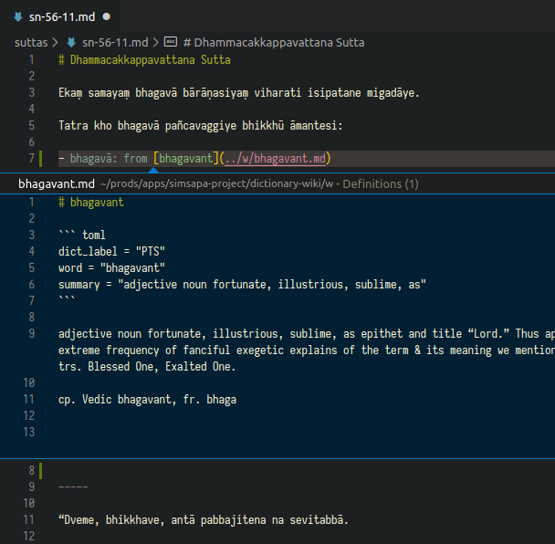
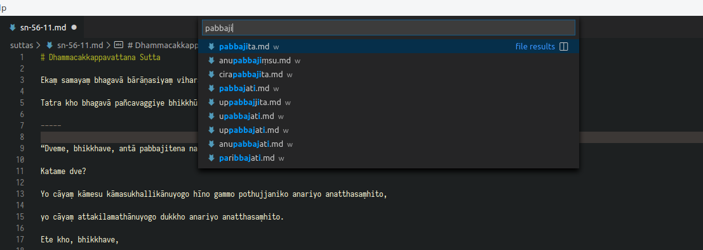

# Simsapa VS Code Extension

This extension adds helper functions to the [VS Code
editor](https://code.visualstudio.com/) for glossing Pali texts (writing
word-by-word analysis), and editing word entries in the
[dictionary-wiki](https://github.com/simsapa/dictionary-wiki).

- Download the `simsapa-vscode-N.N.N.vsix` file from [Releases](https://github.com/simsapa/simsapa-vscode/releases)
- In VS Code, open the Extensions sidebar (View > Extensions)
- At the top, open the menu with the `...` icon
- Select 'Install From VSIX', select the `.vsix` file

<!-- markdown-toc start - Don't edit this section. Run M-x markdown-toc-refresh-toc -->
**Table of Contents**

- [Simsapa VS Code Extension](#simsapa-vs-code-extension)
  - [Features](#features)
    - [Link helpers](#link-helpers)
    - [Links as word definitions](#links-as-word-definitions)
    - [Go to File](#go-to-file)
  - [Commands and Keybindings](#commands-and-keybindings)
  - [Install](#install)
  - [Recommended Extensions](#recommended-extensions)
  - [Release Notes](#release-notes)

<!-- markdown-toc end -->

## Features

A **key-chord** such as `Ctrl+W L` means that you first press `Ctrl+W`, release,
then press `L`.

### Link helpers

`Ctrl+W L` : Toggle Link From Current Word Or Selection

Move the cursor to a Pali word. `Ctrl+W L` will wrap the word in a link, or remove the link if there was one already.


`Ctrl+W Shift+L` : Append Linked Word List

Move the cursor to Pali line which you want to gloss word-by-word. `Ctrl+W Shift+L` will insert a list of links with each word. An `X` will mark the links where the linked word file is missing.


### Links as word definitions

Links can be used to lookup a definition if the linked file exists. These
commands are built-in VS Code.

`Ctrl+Shift+F10` : Peek Definition



`F12` : Go to Definition

`Ctrl+K F12` : Open Definition to the Side

### Go to File

Built-in VS Code command.

`Ctrl+P` : Go to File



## Commands and Keybindings

toggleLinkFromWordOrSelection

Toggle Link From Current Word Or Selection

`Ctrl+W L`

appendLinkedWordListFromLine

Append Linked Word List

`Ctrl+W Shift+L`

File > Preferences > Keyboard Shortcuts

Search for the command name, such as 'Append Linked Word List'. Select the row
and click the edit icon or double click the row to specify a different
keybinding.

## Install

This extension is not published in the extension Marketplace, it has to be
installed with the `.vsix` file.

- Download the `simsapa-vscode-N.N.N.vsix` file from [Releases](https://github.com/simsapa/simsapa-vscode/releases)
- In VS Code, open the Extensions sidebar (View > Extensions)
- At the top, open the menu with the `...` icon
- Select 'Install From VSIX', select the `.vsix` file

Alternatively, you can install it from the command line with:

```
code --install-extension simsapa-vscode-N.N.N.vsix
```

## Recommended Extensions

It will be useful to install an extension which helps writing Markdown.

I recommend [Markdown All in One](https://marketplace.visualstudio.com/items?itemName=yzhang.markdown-all-in-one).

To install it, launch VS Code Quick Open (Ctrl+P), paste the following command, and press enter.

```
ext install yzhang.markdown-all-in-one
```

## Release Notes

See the [Change Log](CHANGELOG.md).

